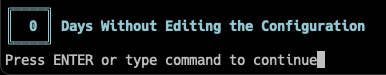

## Ohne Accidents

this is a simple and stupid plugin that tells you how many days have passed without you touching your nvim config



### Installation

With [lazy.nvim](https://github.com/folke/lazy.nvim)

```lazy
  {
    'blumaa/ohne-accidents',
    config = function()
      require("ohne-accidents").setup()
    end
  },

```

