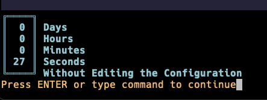

## Ohne Accidents

This is a simple plugin that tells you how many days have passed without you touching your nvim config. Part of its purpose is to prevent unnecessary tweaking of the nvim config.


### Installation

With [lazy.nvim](https://github.com/folke/lazy.nvim)

```lazy
  {
    'blumaa/ohne-accidents',
    config = function()
      require("ohne-accidents").setup()
      vim.api.nvim_set_keymap('n', '<leader>oh', ':OhneAccidents<CR>', {noremap = true, silent = true})
    end
  },

```

### Configuration

The welcome message is set to display by default when you start nvim. You can turn this off by setting it to false.

```
  require("ohne-accidents").setup({ welcomeOnStartup = false })
```

### Detailed Display Message



When you open vim, if you have not set the welcomeOnStartup message to false, only the days will appear in the welcome message. If you want a detailed display message, you can type `:OhneAccidents` or set your own keybidning for it like this:

```
    vim.api.nvim_set_keymap('n', '<leader>oh', ':OhneAccidents<CR>', {noremap = true, silent = true})

```

Look at the installation example above to see where to put the keybinding.

### Alternatives

- [ConfigPulse](https://github.com/mrquantumcodes/configpulse)
- [NvimDaysWithout](https://github.com/idanarye/nvim-days-without)

Each of these works just a little bit differently than ohne-accidents. NvimDaysWithout uses git to calculate things. ConfigPulse uses the config folder but doesn't display a welcome message when you open nvim.
