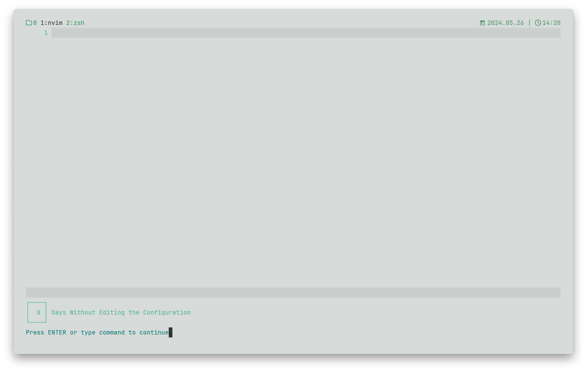
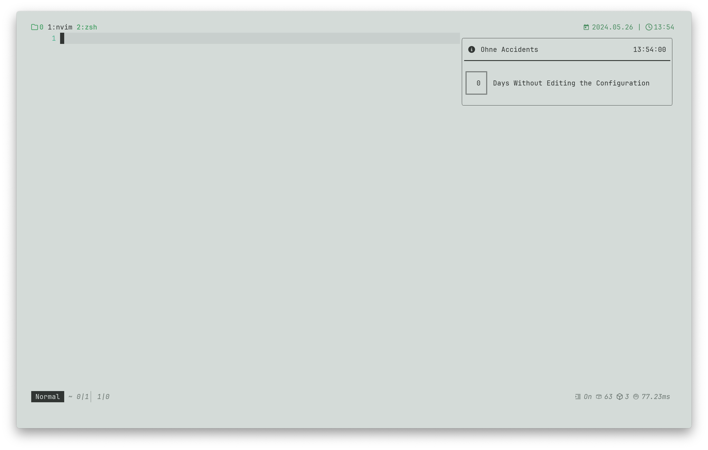
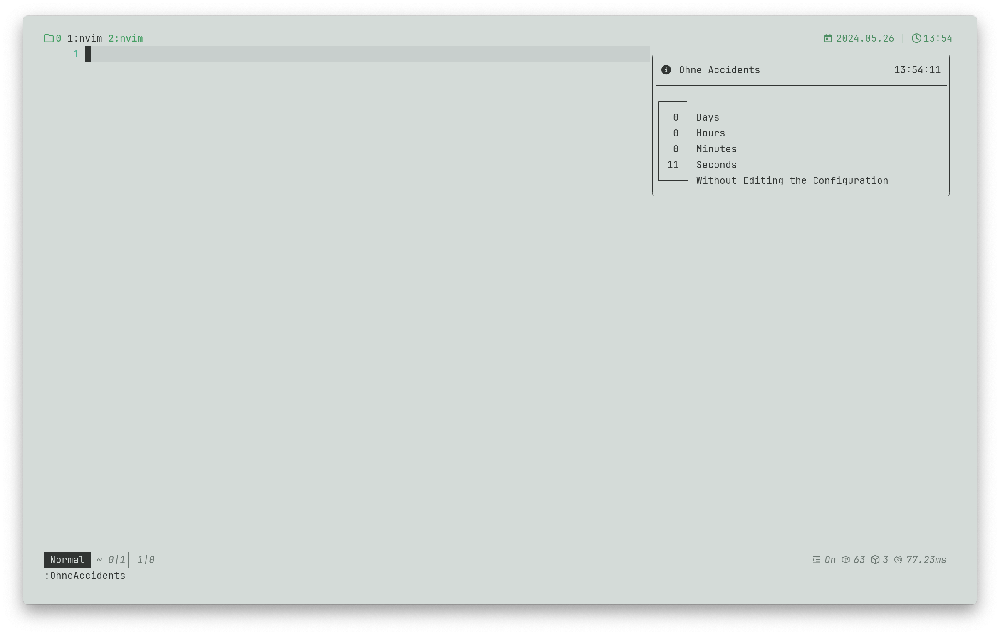

## Ohne Accidents

This is a simple plugin that tells you how many days have passed without you touching your nvim config. Part of its purpose is to prevent unnecessary tweaking of the nvim config.

### `config.api = "echo"`



### `config.api = "notify"`

Welcome Message with [rcarriga/nvim-notify](https://github.com/rcarriga/nvim-notify).



### Installation

With [lazy.nvim](https://github.com/folke/lazy.nvim)

```lua
{
    'blumaa/ohne-accidents.nvim',
    event = "UIEnter", -- Optional, but recommended event if you want to lazy load the plugin.
    ---@type OhneAccidentsConfig
    opts = {}, -- Setting this to {} will use the default configuration and load the plugin.
    keys = {
        {
            "<leader>oh",
            ":OhneAccidents<CR>",
            desc = "Time since last config change"
        },
    },
}
```

### Configuration

This is the default configuration, and their description:

```lua
---@class OhneAccidentsConfig
---@field welcomeOnStartup? boolean Choose whether to display the welcome message on startup.
---@field multiLine? boolean Choose wether the message should be displayed in a single line or multiple lines.
---@field api? "echo" | "notify" Choose whether to use `echo` or `vim.notify` to display the message.
---@field useLastCommit? boolean Use the date of the last commit as the indicator for the time of last changes.
M.config = {
    welcomeOnStartup = true,
    multiLine = true,
    api = "echo",
    useLastCommit = false,
}
```

To set these options, and if you use `lazy.nvim`, you can use the `opts` field like this:

```lua
{
    'blumaa/ohne-accidents.nvim',
    -- ..
    ---@type OhneAccidentsConfig
    opts = {
        welcomeOnStartup = false,
        api = "notify",
    },
    -- ..
}
```

You can also just use the `setup()` function like this:

```lua
require('ohne-accidents').setup({
    welcomeOnStartup = false,
    api = "notify"
})
```

### Detailed Display Message

Detailed Message with [rcarriga/nvim-notify](https://github.com/rcarriga/nvim-notify).



When you open vim, if you have not set the `welcomeOnStartup` message to `false`, only the days will appear in the welcome message. If you want a detailed display message, you can type `:OhneAccidents` or set your own keybidning for it like this:

```lua
vim.api.nvim_set_keymap('n', '<leader>oh', ':OhneAccidents<CR>', { noremap = true, silent = true})
```

Or set the binding via the `lazy.nvim` `keys` API:

```lua
{
    'blumaa/ohne-accidents.nvim',
    -- ..
    keys = {
    {
        "<leader>oh",
        ":OhneAccidents<CR>",
        desc = "Time since last config change"
    },
    -- ..
}
```

Look at the installation example above to see where to put the keybinding.

### Alternatives

Each of these works just a little bit differently than ohne-accidents.

-   [ConfigPulse](https://github.com/mrquantumcodes/configpulse)
    -   ConfigPulse uses the config folder but doesn't display a welcome message when you open nvim.
-   [NvimDaysWithout](https://github.com/idanarye/nvim-days-without)
    -   NvimDaysWithout uses git to calculate things (But this plugin does also has an option for that `config.useLastCommit`).
